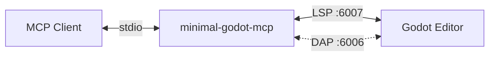

# minimal-godot-mcp

> MCP server bridging Godot's native LSP to AI coding assistants for GDScript validation

[](https://opensource.org/licenses/MIT)
[](https://nodejs.org/)

## Table of Contents

- [Quick Start](#quick-start)
- [Configuration](#configuration)
- [Features](#features)
- [MCP Tools](#mcp-tools)
- [Development](#development)
- [Troubleshooting](#troubleshooting)
- [References](#references)
- [License](#license)

## Quick Start

**Prerequisites:** Node.js 22+, Godot 3.2+ or 4.x with LSP enabled

```bash
git clone https://github.com/ryanmazzolini/minimal-godot-mcp.git
cd minimal-godot-mcp
npm install && npm run build
```

Start Godot with your project, then configure your MCP client (see below).

## Configuration

### Environment Variables

| Variable | Description | Default |
|----------|-------------|---------|
| `GODOT_LSP_PORT` | Override LSP port | Tries 6007, 6005, 6008 |
| `GODOT_WORKSPACE_PATH` | Godot project path | Auto-detected from cwd |
| `GODOT_DAP_PORT` | Override DAP port | Tries 6006, 6010 |
| `GODOT_DAP_BUFFER_SIZE` | Max console entries to buffer | `1000` |

### MCP Client Setup

<details>
<summary><strong>Claude Code</strong></summary>

Add to `~/.claude.json`:

```json
{
  "mcpServers": {
    "godot": {
      "command": "node",
      "args": ["/path/to/minimal-godot-mcp/dist/index.js"],
      "env": {
        "GODOT_WORKSPACE_PATH": "/path/to/your/godot/project"
      }
    }
  }
}
```

</details>

<details>
<summary><strong>Cursor</strong></summary>

Add to `.cursor/mcp.json` in your project:

```json
{
  "mcpServers": {
    "godot": {
      "command": "node",
      "args": ["/path/to/minimal-godot-mcp/dist/index.js"],
      "env": {
        "GODOT_WORKSPACE_PATH": "/path/to/your/godot/project"
      }
    }
  }
}
```

</details>

<details>
<summary><strong>Other MCP Clients</strong></summary>

Configure your client to run:
```bash
node /path/to/minimal-godot-mcp/dist/index.js
```

Set `GODOT_WORKSPACE_PATH` environment variable to your Godot project root.

</details>

## Features

- **Zero-config LSP** - Uses Godot's native Language Server, no plugins required
- **Fast diagnostics** - Single-file checks return quickly
- **Minimal footprint** - Lightweight responses to minimize token usage
- **Resilient connections** - Handles Godot restarts automatically
- **Workspace scanning** - Bulk check all `.gd` files in a project

## MCP Tools

### `get_diagnostics`

Check a single GDScript file for errors.

```json
// Input
{ "file_path": "/path/to/script.gd" }

// Output
{
  "diagnostics": {
    "/path/to/script.gd": [
      { "line": 5, "column": 14, "severity": "error", "message": "Expected identifier", "code": "parse-error" }
    ]
  }
}
```

### `scan_workspace_diagnostics`

Scan all `.gd` files in the workspace (excludes `addons/` and `.godot/`).

```json
// Input
{}

// Output
{
  "files_scanned": 150,
  "files_with_issues": 3,
  "scan_time_seconds": 1.5,
  "diagnostics": { ... }
}
```

### `get_console_output`

Get console output from Godot debug session. Requires a running scene (F5 in Godot).

```json
// Input (all optional)
{
  "limit": 50,
  "category": "console",
  "since": 1706000000000
}

// Output
{
  "entries": [
    { "timestamp": 1706000001234, "category": "console", "message": "Player spawned", "source": "/project/player.gd", "line": 42 }
  ],
  "total_buffered": 150
}
```

Categories: `console` (print statements), `stdout`, `stderr` (errors/warnings).

### `clear_console_output`

Clear the console output buffer.

```json
// Input
{}

// Output
{ "cleared": true }
```

## Development

### Architecture



- **[LSP](https://microsoft.github.io/language-server-protocol/)** (Language Server Protocol, solid line): Always connected for diagnostics
- **[DAP](https://microsoft.github.io/debug-adapter-protocol/specification)** (Debug Adapter Protocol, dotted line): Lazy-connects when `get_console_output` is called with a running scene

See also:

- [Godot external editor setup](https://docs.godotengine.org/en/stable/tutorials/editor/external_editor.html)

### Commands

```bash
npm test          # Run tests
npm run lint      # ESLint + Prettier
npm run build     # Compile TypeScript
```

### Contributing

1. Run `npm run format && npm test` before submitting
2. Test with a real Godot project
3. Keep scope focused on diagnostics

## Troubleshooting

See [docs/troubleshooting.md](docs/troubleshooting.md) for connection issues, missing diagnostics, and debug logging.

## Works Well With

[godot-mcp](https://github.com/satelliteoflove/godot-mcp) by [@satelliteoflove](https://github.com/satelliteoflove) provides runtime control, scene manipulation, screenshots, stack traces, and direct editor interaction through a Godot addon. This project handles the LSP and DAP side — diagnostics and console output with no addon needed.

The two servers are complementary and can run side by side.

## References

- [Model Context Protocol](https://modelcontextprotocol.io/) - Protocol specification
- [Godot LSP](https://docs.godotengine.org/en/stable/tutorials/editor/external_editor.html) - Language Server setup

## License

MIT - see [LICENSE](LICENSE)
